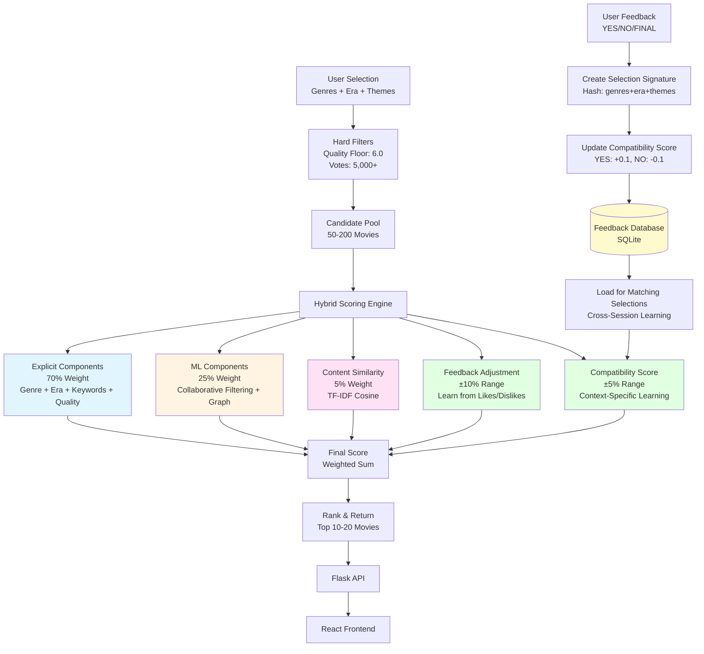
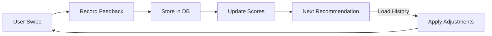

# Movie Finder: Machine Learning Recommendation System

**Advanced Programming 2025 - HEC Lausanne / UNIL**


## Introduction

Movie Finder is a hybrid recommendation system that combines collaborative filtering, graph-based methods, and content similarity to provide personalized movie recommendations. The system learns from user feedback and adapts recommendations across sessions using persistent learning.

What makes it interesting is that it doesn't just use your preferences once and forget them. It remembers what you liked in different contexts - like what works for date night versus what you prefer for a chill evening - and uses that information to improve recommendations over time.

**Key Features:**
- Hybrid ML approach: Collaborative Filtering (15%), Co-occurrence Graph (10%), Content Similarity (5%)
- Persistent feedback learning with context-specific adaptation
- Hard filters ensure quality: minimum 6.0 rating, 5,000+ votes
- Dataset: 45,207 quality movies from IMDb enriched with TMDb metadata
- API response time: under 200ms
- Modern React frontend with swipe-based interaction

---

## Quick Start

**Prerequisites:** Python 3.9+, Node.js, TMDb API key

**Backend:**
```bash
cd DATA_PROJECT
pip install -r requirements.txt
python main.py
```

**Frontend:**
```bash
cd DATA_WEBSITE
npm install
npm run dev
```

Access at `http://localhost:5173`

**First-time setup:** Run `python main.py --pipeline` to train models (2-4 hours)

---

## System Architecture

The Movie Finder system uses a hybrid recommendation architecture that combines explicit user preferences, machine learning models, and adaptive learning from user feedback. Here's how it works:



### Architecture Overview

The system follows a multi-stage pipeline:

1. **Candidate Generation** - Filters 45K+ movies down to 50-200 high-quality candidates
2. **Hybrid Scoring** - Combines 5 different scoring components
3. **Adaptive Learning** - Learns from every swipe and remembers across sessions
4. **Real-time Ranking** - Delivers personalized results in under 200ms

**Scoring Components:**
- Explicit (70%) - User's direct preferences (genre, era, themes)
- ML (25%) - Learns patterns from 1,000+ synthetic user interactions
- Content (5%) - Finds semantic similarity using TF-IDF vectorization
- Feedback (±10%) - Adapts based on what you've liked/disliked
- Compatibility (±5%) - Remembers context-specific preferences (e.g., "Action movies for date night")

---

## How It Works

Movie Finder uses a three-stage pipeline to transform your preferences into recommendations. The system learns from your feedback and gets better over time.

### User Flow

The recommendation process begins with a simple questionnaire that captures your preferences and context. Each step collects information that helps the system understand what you're looking for.


**Step 1: Landing Page**

The application starts with a clean landing page where you can begin your movie discovery journey. You can get started immediately, sign up to save your preferences, or skip directly to the questionnaire. The interface highlights that the process takes only four questions and promises personalized recommendations.


**Step 2: Select Your Evening Type**

The first question asks about your plan for the evening. This context is crucial because the system learns that your movie preferences vary depending on the situation. You choose from four options:

- **Chill Evening by myself**: For relaxed solo viewing when you're open to experimenting
- **Date Night**: For impressive movies that work well for a special evening
- **Family Night**: For safe, reliable entertainment suitable for everyone
- **Friends Night**: For fun social viewing experiences

The system remembers your preferences for each context separately, so it can recommend action movies for date nights while suggesting comedies for family nights.


**Step 3: Choose Your Genres**

Next, you select one or two genres from a curated list. Popular choices like Thriller, Drama, Sci-Fi, Mystery, Horror, and Documentary are prominently displayed, with additional genres available below. This selection forms the primary filter for candidate movies, ensuring recommendations match your preferred style.


**Step 4: Select Time Period**

You choose the era you're in the mood for. Options range from contemporary cinema (2010+) to classic films (before 2000), or you can indicate no preference. This helps the system filter candidates to match your temporal preferences, whether you want something modern or nostalgic.


**Step 5: Add Themes and Keywords**

You can optionally select up to three themes that interest you, such as Revenge, Martial Arts, Serial Killer, Gangster, Detective, or Dystopia. There's also an option for movies based on comics or manga. These keywords are matched against movie descriptions and metadata to find films with similar thematic elements.


**Step 6: Review Recommendations**

Once you've completed the questionnaire, the system displays movie recommendations one at a time. Each card shows the movie title, release year, rating, duration, director, and a synopsis. The interface uses a swipe-based interaction model where you can:

- Swipe right or click "YES" to indicate interest
- Swipe left or click "NOPE" to reject
- Click "THAT'S THE ONE!" to select your final choice

As you interact with each recommendation, the system learns from your feedback and adjusts subsequent suggestions in real-time. Your preferences are stored with the full context of your selection (genres, era, themes, evening type), allowing the system to remember what works for similar situations in future sessions.

### Recommendation Process

Behind the scenes, the system processes your preferences through three stages to deliver personalized recommendations.

**Stage 1: Candidate Generation**

The system starts with a database of 45,207 movies from IMDb, enriched with metadata from TMDb. Before any scoring begins, it applies strict quality filters to ensure only worthwhile movies are considered:

- **Genre matching**: Only movies that match your selected genres are included
- **Quality floor**: Movies must have a minimum rating of 6.0 out of 10
- **Popularity threshold**: Movies need at least 5,000 user votes to ensure they're well-known enough
- **Era filtering**: Movies are filtered based on your time period preference

These filters reduce the pool from 45,000+ movies down to 50-200 high-quality candidates that match your basic criteria. This focused pool ensures the system only considers movies worth recommending.

**Stage 2: Hybrid Scoring**

Each candidate movie receives a score calculated from multiple components. The system combines explicit preferences, machine learning insights, and content analysis to determine how well each movie matches your taste.

**Explicit Components (70% of the score):**
These components directly reflect your stated preferences:
- **Genre match (30%)**: How well the movie matches your selected genres
- **Era match (15%)**: Whether the movie falls within your preferred time period
- **Theme keywords (20%)**: How many of your selected themes appear in the movie's description or metadata
- **Quality score (5%)**: The movie's rating normalized to a 0-1 scale

**Machine Learning Components (25% of the score):**
These components learn patterns from user behavior:
- **Collaborative Filtering (15%)**: Identifies movies that users with similar preferences have enjoyed, using matrix factorization on interaction data
- **Co-occurrence Graph (10%)**: Uses a graph of movies that are frequently watched together to find related recommendations

**Content Similarity (5% of the score):**
- **TF-IDF cosine similarity**: Analyzes movie descriptions and plots to find films with similar themes and narrative elements, even if they don't share exact keywords

**Adaptive Adjustments:**
The system continuously learns from your feedback:
- **Feedback Adjustment (±10%)**: Movies similar to ones you've liked receive a boost, while movies similar to ones you've rejected are penalized
- **Compatibility Score (±5%)**: Remembers context-specific preferences. For example, if you consistently like action movies for date nights, future date night recommendations will favor action films

**Stage 3: Ranking & Delivery**

All scoring components are combined into a single weighted score for each movie. The candidates are ranked from highest to lowest score, and the top 10-20 movies are returned to you. This entire process completes in under 200 milliseconds, ensuring instant recommendations as you swipe through movies.

### The Learning Loop

What makes Movie Finder different from static recommendation systems is its ability to learn and adapt from every interaction. The system doesn't just use your preferences once and forget them—it builds a memory of what works for you in different contexts.

**How Learning Works:**

Every time you interact with a movie recommendation, the system records your feedback along with the complete context of your selection:

1. **Feedback Recording**: Your response (YES, NO, or FINAL) is stored with all the details: which genres you selected, what time period you chose, which themes interested you, and what type of evening you planned for.

2. **Selection Signature**: The system creates a unique identifier (hash) for your combination of preferences. This allows it to recognize when you make similar selections in the future.

3. **Compatibility Updates**: For each movie you interact with, the system updates compatibility scores. When you say YES, it adds 0.1 to the compatibility score. When you say NO, it subtracts 0.1. These scores accumulate over time, building a profile of what works for each specific context.

4. **Persistent Storage**: All feedback is stored in a SQLite database, allowing the system to remember your preferences across sessions. If you close the application and return later, your learning history is preserved.

5. **Real-time Adaptation**: As you continue swiping, the system immediately adjusts subsequent recommendations. Movies similar to ones you liked receive higher scores, while movies similar to ones you rejected are deprioritized.

**Progressive Improvement:**

The system gets better with each use:
- **First session**: Recommendations are based on your explicit preferences (genres, era, themes) combined with general patterns from other users
- **Second session**: The system remembers your past preferences and applies them when you make similar selections
- **Tenth session**: By this point, the system has learned your specific taste patterns and can predict what you'll like with high accuracy

This learning happens automatically in the background. You don't need to do anything special—just use the system naturally, and it adapts to your preferences over time.

---

## Scoring Mathematics

### Hybrid Scoring Formula

```
Base Score = Explicit Components (70%)
           + ML Components (25%)
           + Content Similarity (5%)

Final Score = Base Score
            + Feedback Adjustment (±10%)
            + Compatibility Adjustment (±5%)
```

### Component Breakdown

**Explicit Components (70%):**
- Genre Match: 30%
- Era Match: 15%
- Theme Keywords: 20%
- Quality Score: 5%

**ML Components (25%):**
- Collaborative Filtering: 15%
- Co-occurrence Graph: 10%

**Content Similarity (5%):**
- TF-IDF cosine similarity: 5%

**Adjustments:**
- Feedback Adjustment: ±10% (based on similarity to liked/rejected movies)
- Compatibility Adjustment: ±5% (context-specific learning)

### Example Calculation

```
Movie: "The Bourne Identity"
┌─────────────────────────────────────────┐
│ Component              │ Score │ Weight │
├────────────────────────┼───────┼────────┤
│ Genre Match            │ 0.30  │  30%   │
│ Era Match              │ 0.15  │  15%   │
│ Theme Keywords         │ 0.20  │  20%   │
│ Quality Score          │ 0.05  │   5%   │
│ CF Score               │ 0.12  │  15%   │
│ Graph Score            │ 0.08  │  10%   │
│ Content Score          │ 0.04  │   5%   │
│ Feedback Adjustment    │+0.05  │ ±10%   │
│ Compatibility Adj.     │+0.03  │  ±5%   │
├────────────────────────┼───────┼────────┤
│ TOTAL SCORE            │ 1.02  │ 100%   │
│ (clamped to [0, 1])    │ 1.00  │        │
└─────────────────────────────────────────┘
```

### Mathematical Foundations

**Collaborative Filtering (ImplicitALS):**
- Matrix factorization: R ≈ U × M^T
- Loss function: ||W × (R - U × M^T)||² + λ(||U||² + ||M||²)
- 50 latent dimensions, trained on 1,000 synthetic users
- Weight: 15%

**Co-occurrence Graph:**
- Edge weight: Σ(signal_i × signal_j) for all sessions
- Signal strength: up-up = 1.0, up-right = 0.3, right-right = 0.09
- Sparse adjacency matrix: 45K × 45K
- Weight: 10%

**Content Similarity (TF-IDF):**
- TF-IDF(t, d) = TF(t, d) × IDF(t)
- IDF(t) = log(total_documents / documents_containing_term)
- Similarity = cosine_similarity(vector1, vector2)
- Weight: 5%

---

## Learning System

Unlike static recommendation systems, Movie Finder learns and adapts from every interaction. The system gets better over time as it learns your preferences.

### Persistent Feedback Learning

The system stores all user interactions in SQLite (`output/feedback.db`):

- **user_feedback**: Individual feedback events with context
- **user_preferences**: Aggregated preference profiles
- **movie_statistics**: Movie performance metrics
- **selection_movie_compatibility**: Context-specific compatibility scores

### Selection-to-Movie Compatibility

This is what makes Movie Finder remember your preferences across sessions:

**How it works:**
1. User selects: genres + era + themes → creates selection signature (hash)
2. User says YES → compatibility_score += 0.1
3. User says NO → compatibility_score -= 0.1
4. Scores accumulate, clamped to [-1.0, +1.0]
5. Applied only for matching selection context

If you love action movies for "date night" but prefer comedies for "chill evening," the system remembers both. It tracks what works for each specific context.

**Mathematical details:**
- Score update: `new_score = current_score ± 0.1`
- Weight in final score: `compatibility_score × 0.05` (±5%)
- No time decay: all feedback equally weighted

### Feedback Adjustment

The system learns patterns from your feedback:

**Positive boost:**
- `max(similarity to liked movies) × 0.10`
- Range: [0, +0.10]
- Movies similar to ones you liked get a boost

**Negative penalty:**
- `max(similarity to rejected movies) × 0.10`
- Range: [-0.10, 0]
- Movies similar to ones you rejected get penalized

### Learning Flow



---

## Installation

### Backend Setup

1. Install dependencies:
```bash
pip install -r requirements.txt
```

2. Configure TMDb API key:
Create `config/tmdb_config.json`:
```json
{
  "api_key": "your_api_key_here"
}
```

3. Train models (first time only):
```bash
python main.py --pipeline
```

### Frontend Setup

1. Install dependencies:
```bash
npm install
```

2. Start development server:
```bash
npm run dev
```

---

## Usage

### Web Interface

1. Start backend: `python main.py`
2. Start frontend: `npm run dev`
3. Open `http://localhost:5173`
4. Complete questionnaire
5. Swipe through recommendations

### CLI Tools

**Simple questionnaire:**
```bash
python main.py --cli
```

**Interactive swipe:**
```bash
python main.py --interactive
```

---

## API Endpoints

- `GET /health` - System status
- `GET /api/questionnaire/options` - Available options
- `POST /api/questionnaire/keywords` - Keyword suggestions
- `POST /api/recommend` - Get recommendations
- `POST /api/feedback` - Record feedback
- `GET /api/movie/<id>` - Movie details

---

## Project Structure

```
DATA_PROJECT/
├── api_smart.py              # Flask API
├── smart_engine.py           # Recommendation engine
├── src/
│   ├── models/
│   │   ├── collaborative_filtering.py
│   │   ├── cooccurrence_graph.py
│   │   └── content_similarity.py
│   └── recommendation/
│       └── smart_engine.py
├── output/
│   ├── processed/movies.parquet
│   ├── models/
│   └── feedback.db
└── config/
    └── tmdb_config.json
```

---

## Troubleshooting

**Models not found:**
```bash
python main.py --pipeline
```

**Port conflicts:**
```bash
python main.py --port 8000
```

**CORS errors:**
- Verify backend running on port 5000
- Check frontend `.env` configuration

**Connection issues:**
- Verify both backend and frontend running
- Check `curl http://localhost:5000/health`

---

## Performance

- **Dataset:** 45,207 movies
- **API response time:** <200ms
- **Recommendation generation:** <150ms
- **TMDb coverage:** 99.3%

---

## License

Educational project for Advanced Programming 2025.
Not for commercial use.
