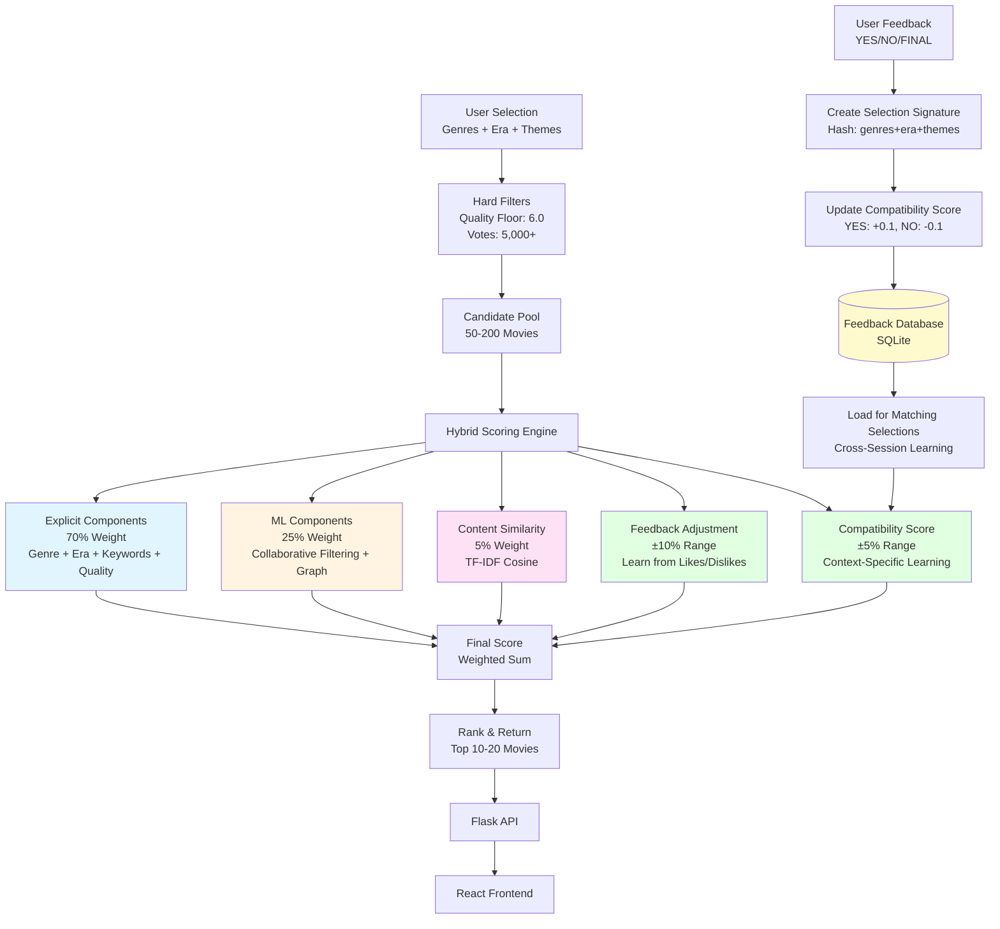
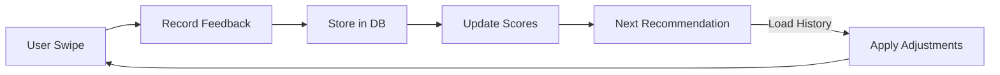

# Movie Finder: Machine Learning Recommendation System

**Advanced Programming 2025 - HEC Lausanne / UNIL**


## Introduction

Movie Finder is a hybrid recommendation system that combines collaborative filtering, graph-based methods, and content similarity to provide personalized movie recommendations. The system learns from user feedback and adapts recommendations across sessions using persistent learning.

What makes it interesting is that it doesn't just use your preferences once and forget them. It remembers what you liked in different contexts - like what works for date night versus what you prefer for a chill evening - and uses that information to improve recommendations over time.

**Key Features:**
- Hybrid ML approach: Collaborative Filtering (15%), Co-occurrence Graph (10%), Content Similarity (5%)
- Persistent feedback learning with context-specific adaptation
- Hard filters ensure quality: minimum 6.0 rating, 5,000+ votes
- Dataset: 45,207 quality movies from IMDb enriched with TMDb metadata
- API response time: under 200ms
- Modern React frontend with swipe-based interaction

---

## Quick Start

**Prerequisites:** Python 3.9+, Node.js, TMDb API key

**Backend:**
```bash
cd DATA_PROJECT
pip install -r requirements.txt
python main.py
```

**Frontend:**
```bash
cd DATA_WEBSITE
npm install
npm run dev
```

Access at `http://localhost:5173`

**First-time setup:** Run `python main.py --pipeline` to train models (2-4 hours)

---

## System Architecture

The Movie Finder system uses a hybrid recommendation architecture that combines explicit user preferences, machine learning models, and adaptive learning from user feedback. Here's how it works:



### Architecture Overview

The system follows a multi-stage pipeline:

1. **Candidate Generation** - Filters 45K+ movies down to 50-200 high-quality candidates
2. **Hybrid Scoring** - Combines 5 different scoring components
3. **Adaptive Learning** - Learns from every swipe and remembers across sessions
4. **Real-time Ranking** - Delivers personalized results in under 200ms

**Scoring Components:**
- Explicit (70%) - User's direct preferences (genre, era, themes)
- ML (25%) - Learns patterns from 1,000+ synthetic user interactions
- Content (5%) - Finds semantic similarity using TF-IDF vectorization
- Feedback (±10%) - Adapts based on what you've liked/disliked
- Compatibility (±5%) - Remembers context-specific preferences (e.g., "Action movies for date night")

---

## How It Works

Movie Finder uses a three-stage pipeline to transform your preferences into recommendations. The system learns from your feedback and gets better over time.

### User Flow


*Step 1: User selects evening type (Date Night, Family, Friends, Chill Evening)*


*Step 2: User selects 1-2 genres*


*Step 3: User selects era (optional)*


*Step 4: User adds themes/keywords (optional)*


*Step 5: System displays movie cards one at a time*


*Step 6: User swipes (YES/NO/FINAL) - system learns and adapts*

### Recommendation Process

**Stage 1: Candidate Generation**

The system starts with 45,207 movies from IMDb and applies quality filters:
- Genre matching - Only movies in your selected genres
- Quality floor - Minimum 6.0 rating
- Popularity threshold - At least 5,000 votes
- Era filtering - Respects your time period preferences

This results in a pool of 50-200 high-quality candidates ready for scoring.

**Stage 2: Hybrid Scoring**

Each candidate movie gets scored using multiple components:

**Explicit Components (70% weight):**
- Genre match: 30% - Does it match your selected genres?
- Era match: 15% - Is it from your preferred time period?
- Theme keywords: 20% - Does it contain your thematic keywords?
- Quality score: 5% - How highly rated is it?

**ML Components (25% weight):**
- Collaborative Filtering (15%) - Uses patterns from similar users
- Co-occurrence Graph (10%) - Uses movies that are watched together

**Content Similarity (5% weight):**
- TF-IDF cosine similarity - Finds movies with similar themes/descriptions

**Adaptive Adjustments:**
- Feedback Adjustment (±10%) - Boosts movies similar to ones you liked, penalizes ones like those you rejected
- Compatibility Score (±5%) - Remembers context-specific preferences (e.g., "You love action movies for date night")

**Stage 3: Ranking & Delivery**

All scores are combined into a final weighted score, movies are ranked, and the top 10-20 are returned. This happens in under 200ms.

### The Learning Loop

The system learns from every interaction:

Every time you swipe:
1. Your feedback is recorded with full context (genres, era, themes)
2. A selection signature is created - a unique hash of your preferences
3. Compatibility scores update - YES adds +0.1, NO subtracts -0.1
4. Everything is stored in the feedback database for cross-session learning
5. Next recommendations adapt - The system remembers what worked for similar contexts

The more you use it, the better it gets. First session gives good recommendations based on your explicit preferences. Second session is better because it remembers your past preferences. By the tenth session, the system has learned a lot about your taste.

---

## Scoring Mathematics

### Hybrid Scoring Formula

```
Base Score = Explicit Components (70%)
           + ML Components (25%)
           + Content Similarity (5%)

Final Score = Base Score
            + Feedback Adjustment (±10%)
            + Compatibility Adjustment (±5%)
```

### Component Breakdown

**Explicit Components (70%):**
- Genre Match: 30%
- Era Match: 15%
- Theme Keywords: 20%
- Quality Score: 5%

**ML Components (25%):**
- Collaborative Filtering: 15%
- Co-occurrence Graph: 10%

**Content Similarity (5%):**
- TF-IDF cosine similarity: 5%

**Adjustments:**
- Feedback Adjustment: ±10% (based on similarity to liked/rejected movies)
- Compatibility Adjustment: ±5% (context-specific learning)

### Example Calculation

```
Movie: "The Bourne Identity"
┌─────────────────────────────────────────┐
│ Component              │ Score │ Weight │
├────────────────────────┼───────┼────────┤
│ Genre Match            │ 0.30  │  30%   │
│ Era Match              │ 0.15  │  15%   │
│ Theme Keywords         │ 0.20  │  20%   │
│ Quality Score          │ 0.05  │   5%   │
│ CF Score               │ 0.12  │  15%   │
│ Graph Score            │ 0.08  │  10%   │
│ Content Score          │ 0.04  │   5%   │
│ Feedback Adjustment    │+0.05  │ ±10%   │
│ Compatibility Adj.     │+0.03  │  ±5%   │
├────────────────────────┼───────┼────────┤
│ TOTAL SCORE            │ 1.02  │ 100%   │
│ (clamped to [0, 1])    │ 1.00  │        │
└─────────────────────────────────────────┘
```

### Mathematical Foundations

**Collaborative Filtering (ImplicitALS):**
- Matrix factorization: R ≈ U × M^T
- Loss function: ||W × (R - U × M^T)||² + λ(||U||² + ||M||²)
- 50 latent dimensions, trained on 1,000 synthetic users
- Weight: 15%

**Co-occurrence Graph:**
- Edge weight: Σ(signal_i × signal_j) for all sessions
- Signal strength: up-up = 1.0, up-right = 0.3, right-right = 0.09
- Sparse adjacency matrix: 45K × 45K
- Weight: 10%

**Content Similarity (TF-IDF):**
- TF-IDF(t, d) = TF(t, d) × IDF(t)
- IDF(t) = log(total_documents / documents_containing_term)
- Similarity = cosine_similarity(vector1, vector2)
- Weight: 5%

---

## Learning System

Unlike static recommendation systems, Movie Finder learns and adapts from every interaction. The system gets better over time as it learns your preferences.

### Persistent Feedback Learning

The system stores all user interactions in SQLite (`output/feedback.db`):

- **user_feedback**: Individual feedback events with context
- **user_preferences**: Aggregated preference profiles
- **movie_statistics**: Movie performance metrics
- **selection_movie_compatibility**: Context-specific compatibility scores

### Selection-to-Movie Compatibility

This is what makes Movie Finder remember your preferences across sessions:

**How it works:**
1. User selects: genres + era + themes → creates selection signature (hash)
2. User says YES → compatibility_score += 0.1
3. User says NO → compatibility_score -= 0.1
4. Scores accumulate, clamped to [-1.0, +1.0]
5. Applied only for matching selection context

If you love action movies for "date night" but prefer comedies for "chill evening," the system remembers both. It tracks what works for each specific context.

**Mathematical details:**
- Score update: `new_score = current_score ± 0.1`
- Weight in final score: `compatibility_score × 0.05` (±5%)
- No time decay: all feedback equally weighted

### Feedback Adjustment

The system learns patterns from your feedback:

**Positive boost:**
- `max(similarity to liked movies) × 0.10`
- Range: [0, +0.10]
- Movies similar to ones you liked get a boost

**Negative penalty:**
- `max(similarity to rejected movies) × 0.10`
- Range: [-0.10, 0]
- Movies similar to ones you rejected get penalized

### Learning Flow



---

## Installation

### Backend Setup

1. Install dependencies:
```bash
pip install -r requirements.txt
```

2. Configure TMDb API key:
Create `config/tmdb_config.json`:
```json
{
  "api_key": "your_api_key_here"
}
```

3. Train models (first time only):
```bash
python main.py --pipeline
```

### Frontend Setup

1. Install dependencies:
```bash
npm install
```

2. Start development server:
```bash
npm run dev
```

---

## Usage

### Web Interface

1. Start backend: `python main.py`
2. Start frontend: `npm run dev`
3. Open `http://localhost:5173`
4. Complete questionnaire
5. Swipe through recommendations

### CLI Tools

**Simple questionnaire:**
```bash
python main.py --cli
```

**Interactive swipe:**
```bash
python main.py --interactive
```

---

## API Endpoints

- `GET /health` - System status
- `GET /api/questionnaire/options` - Available options
- `POST /api/questionnaire/keywords` - Keyword suggestions
- `POST /api/recommend` - Get recommendations
- `POST /api/feedback` - Record feedback
- `GET /api/movie/<id>` - Movie details

---

## Project Structure

```
DATA_PROJECT/
├── api_smart.py              # Flask API
├── smart_engine.py           # Recommendation engine
├── src/
│   ├── models/
│   │   ├── collaborative_filtering.py
│   │   ├── cooccurrence_graph.py
│   │   └── content_similarity.py
│   └── recommendation/
│       └── smart_engine.py
├── output/
│   ├── processed/movies.parquet
│   ├── models/
│   └── feedback.db
└── config/
    └── tmdb_config.json
```

---

## Troubleshooting

**Models not found:**
```bash
python main.py --pipeline
```

**Port conflicts:**
```bash
python main.py --port 8000
```

**CORS errors:**
- Verify backend running on port 5000
- Check frontend `.env` configuration

**Connection issues:**
- Verify both backend and frontend running
- Check `curl http://localhost:5000/health`

---

## Performance

- **Dataset:** 45,207 movies
- **API response time:** <200ms
- **Recommendation generation:** <150ms
- **TMDb coverage:** 99.3%

---

## License

Educational project for Advanced Programming 2025.
Not for commercial use.
